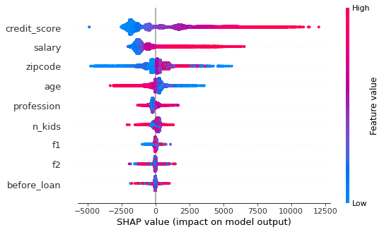
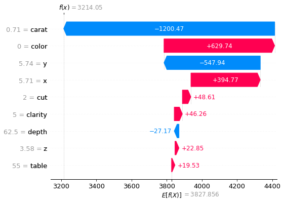

# House Prices - Advanced Regression Techniques
Interpretable Gradient Boosting - Real Estate House Price Prediction
### Description <a href="https://www.kaggle.com/competitions/house-prices-advanced-regression-techniques">Kaggle competition</a>
Ask a home buyer to describe their dream house, and they probably won't begin with the height of the basement ceiling or the proximity to an east-west railroad. But this playground competition's dataset proves that much more influences price negotiations than the number of bedrooms or a white-picket fence.
With 79 explanatory variables describing (almost) every aspect of residential homes in Ames, Iowa, this competition challenges you to predict the final price of each home.

### <a href="https://github.com/DavidGomezCamargo/Project/tree/Milestone-1">Milestone 1 </a>
Set up a development environment in your laptop. Follow the github repository URL with a branch titled ‘milestone-1’ with the README.md file containing the installation instructions followed and a screenshot of your docker container terminal prompt.
### <a href="https://github.com/DavidGomezCamargo/Project/blob/Milestone-2/Milestone_2.ipynb">Milestone 2 - Google Colab</a>
SHAP interpretation of the house price prediction model with graphs that show the SHAP values for the features and the SHAP interaction values for these features.
### <a href="https://github.com/DavidGomezCamargo/Project/blob/Milestone-3/Milestone_3.ipynb">Milestone 3 - Google Colab</a>
Hyperparameters tuning with Optuna of the LightGBM model. Created a streamlit app for the house price prediction problem. Streamlit is a python library that allows you to create web apps with minimal coding and deploy them in the cloud. Deployed the streamlit app in HuggingFace streamlit spaces with a SHAP summary plot and a SHAP interaction plot. Link to the deployed <a href="https://huggingface.co/spaces/DavidGomezCamargo/demo_app">HF space</a> where the Milestone 2 calculation and the optimized app calculation price prediction can both be seen.

### What is SHAP and Shapley values?
SHAP (SHapley Additive exPlanations) is a Python package based on the 2016 NIPS paper about SHAP values. The premise of this paper and Shapley values comes from approaches in game theory.
One of the questions often posed in games is that in a group of n players with different skillsets, how do we divide a prize so that everyone gets a fair share based on their skill set? Depending on the number of players, their time of joining the game, and their different contributions to the outcome, this type of calculation can become horribly complex.
But what does game theory have to do with machine learning? Well, we could reframe the above question so that it becomes "Given a prediction, how do we most accurately measure each feature's contribution?" Yes, it is like asking feature importances of a model, but the answer the Shapley values give is much more sophisticated.
Specifically, Shapley values can help you in:
1. Global model interpretability - imagine you work for a bank and build a classification model for loan applications. Your manager wants you to explain what (and how) different factors influence the decisions of your model. Using SHAP values, you can give a concrete answer with details of which features lead to more loans and which features lead to more rejections. You make your manager happy because now, he can draw up basic guidelines for future bank customers to increase their chances of getting a loan. More loans mean more money means a happier manager means a higher salary for you.
   

2. Local interpretability - your model rejects one of the applications submitted to the bank a few days ago. The customer claims he followed all the guidelines and was sure to get a loan from your bank. Now, you are legally obligated to explain why your model rejected that particular candidate. Using Shapley values, every case can be analyzed independently, without worrying about its connections to other samples in the data. In other words, you have local interpretability. You extract the Shapley values for the complaining customer and show them what parts of their application caused the rejection. You prove them wrong with a plot like this:
   

<a href="">Landing page for the prediction app - Google Site</a>

<a href="">Demostration video</a>
